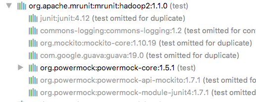
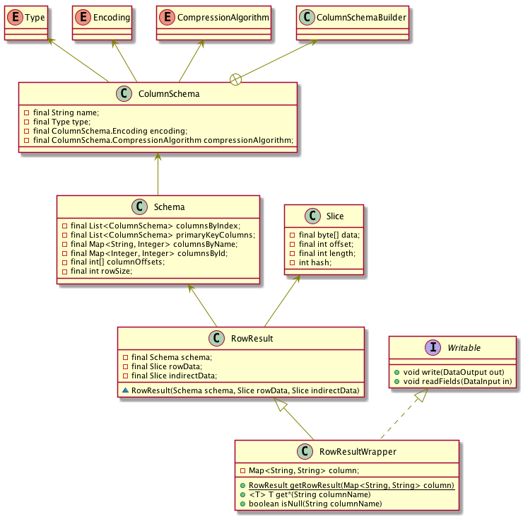
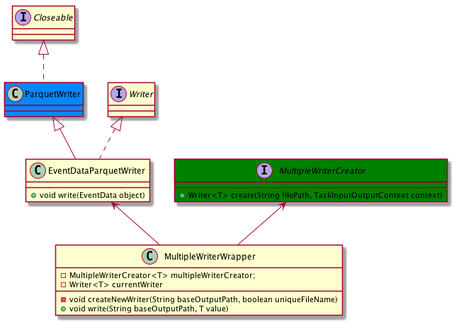

# MRUnit

Apache MRUnit ™ is a Java library that helps developers unit test Apache Hadoop map reduce jobs.

## Add dependency

    <dependency>
        <groupId>org.apache.mrunit</groupId>
        <artifactId>mrunit</artifactId>
        <version>1.1.0</version>
        <classifier>hadoop2</classifier>
        <scope>test</scope>
    </dependency>

## MapperTest
    import org.apache.hadoop.mrunit.mapreduce.MapDriver;
    ...
    @Test public void WordCountMapper_inputLineShouldSplitBySpace() throws IOException {
        WordCountMR.WordCountMapper mapper = new WordCountMR.WordCountMapper();
        MapDriver<LongWritable, Text, Text, IntWritable> mapDriver = MapDriver.newMapDriver(mapper);
        Text inValue = new Text("love is a ...");
        mapDriver.withInput(new LongWritable(), inValue);
        mapDriver.withOutput(new Text("love"), new IntWritable(1));
        mapDriver.withOutput(new Text("is"), new IntWritable(1));
        mapDriver.withOutput(new Text("a"), new IntWritable(1));
        mapDriver.withOutput(new Text("..."), new IntWritable(1));
        mapDriver.runTest();
    }

## ReducerTest

    import org.apache.hadoop.mrunit.mapreduce.ReduceDriver;
    ...        
    @Test public void WordCountReducer_shouldCountTheNumberOfWordTimes() throws IOException {
        WordCountReducer reducer = new WordCountReducer();
        ReduceDriver<Text, IntWritable, Text, LongWritable> reduceDriver = ReduceDriver.newReduceDriver(reducer);
        Text key1 = new Text("love");
        ArrayList<IntWritable> values1 = new ArrayList<IntWritable>() {
        {
            add(new IntWritable(1));
            add(new IntWritable(1));
            add(new IntWritable(1));
        }
        };
        reduceDriver.withInput(key1, values1);
        Text key2 = new Text("is");
        ArrayList<IntWritable> values2 = new ArrayList<IntWritable>() {
        {
            add(new IntWritable(1));
            add(new IntWritable(1));
        }
        };
        reduceDriver.withInput(key2, values2);
        Text key3 = new Text("a");
        ArrayList<IntWritable> values3 = new ArrayList<IntWritable>() {
        {
            add(new IntWritable(1));
        }
        };
        reduceDriver.withInput(key3, values3);

        reduceDriver.withOutput(key1, new LongWritable(3));
        reduceDriver.withOutput(key2, new LongWritable(2));
        reduceDriver.withOutput(key3, new LongWritable(1));

        reduceDriver.runTest();
    }

## MRTest

    import org.apache.hadoop.mrunit.mapreduce.MapReduceDriver;
    ...
    @Test public void WordCountMR_shouldCountTheNumberOfWordTimesByInputLine() throws IOException {
        WordCountReducer reducer = new WordCountReducer();
        WordCountMapper mapper = new WordCountMapper();
        MapReduceDriver<LongWritable, Text, Text, IntWritable, Text, LongWritable> MRDriver =
            MapReduceDriver.newMapReduceDriver(mapper, reducer);
        MRDriver.withInput(new LongWritable(), new Text("love is a touch and yet not a touch"));

        MRDriver.withOutput(new Text("a"), new LongWritable(2));
        MRDriver.withOutput(new Text("and"), new LongWritable(1));
        MRDriver.withOutput(new Text("is"), new LongWritable(1));
        MRDriver.withOutput(new Text("love"), new LongWritable(1));
        MRDriver.withOutput(new Text("not"), new LongWritable(1));
        MRDriver.withOutput(new Text("touch"), new LongWritable(2));
        MRDriver.withOutput(new Text("yet"), new LongWritable(1));

        MRDriver.runTest();
    }

## MRShuffler

    public class TestMRShuffle {
        MapOutputShuffler shuffler;

        @Before public void setUp() {
            shuffler = new MapOutputShuffler<Shop, IntWritable>(new Configuration(), Shop::compareTo, Shop::compareToByProvince);
        }

        @Test public void shuffle_shopShouldCompareByProfit() {
            List<Pair<Shop, Text>> mapOutput = new ArrayList<>();
            mapOutput.add(new Pair<>(new Shop('E', 7), new Text("g")));
            mapOutput.add(new Pair<>(new Shop('D', 1), new Text("a")));
            mapOutput.add(new Pair<>(new Shop('D', 2), new Text("b")));
            mapOutput.add(new Pair<>(new Shop('A', 9), new Text("i")));
            mapOutput.add(new Pair<>(new Shop('E', 8), new Text("h")));
            mapOutput.add(new Pair<>(new Shop('D', 5), new Text("e")));
            mapOutput.add(new Pair<>(new Shop('D', 3), new Text("c")));
            mapOutput.add(new Pair<>(new Shop('D', 4), new Text("d")));
            mapOutput.add(new Pair<>(new Shop('E', 6), new Text("f")));
            ArrayList<Pair<Shop, List<Text>>> expect = new ArrayList<>();
            expect.add(new Pair<>(new Shop('D', 1), new ArrayList<Text>() {
            {
                add(new Text("a"));
                add(new Text("b"));
                add(new Text("c"));
                add(new Text("d"));
                add(new Text("e"));
            }
            }));
            expect.add(new Pair<>(new Shop('E', 6), new ArrayList<Text>() {
            {
                add(new Text("f"));
                add(new Text("g"));
                add(new Text("h"));
            }
            }));
            expect.add(new Pair<>(new Shop('A', 9), new ArrayList<Text>() {
            {
                add(new Text("i"));
            }
            }));

            List<Pair<Shop, Text>> actual = shuffler.shuffle(mapOutput);

            assertEquals(expect, actual);
        }
    }

## ⚠️

    NoClassDefFoundError: org/powermock/tests/utils/RunnerTestSuiteChunker

    <properties>
        <powermock.version>1.7.1</powermock.version>
    </properties>
    <dependency>
        <groupId>org.powermock</groupId>
        <artifactId>powermock-core</artifactId>
        <version>${powermock.version}</version>
        <scope>test</scope>
    </dependency>

# k2p unit test

## mapper

1. KuduToParquetMapper
    
    - input: <NullWritable, RowResult>
    - output: <KuduToParquetKey, BytesWritable>
    - convert to EventData
    - new K2PKey and initialize
    - serialize
    - context write

2. RowResult

    构造器访问权限为package private.

3. RowResultWrapper

    java.lang.IllegalStateException: No applicable class implementing Serialization in conf at io.serializations: class org.apache.kudu.client.RowResultWrapper

4. implements Writable 

    

5. initRowResults
6. driver.withInput 
7. convertToK2PKey4Mapper
8. serializeEventData
9. driver.withOutput
    override hashCode()
    override equals()
10. run

## reducer

1. KuduToParquetReducer

    - input: <KuduToParquetKey, BytesWritable>
    - output: <NullWritable, NullWritable>
    - foreach values and deserialize to EventData
    - set current k2pKey by event data
    - get pair <MultipleWriterWrapper, UserIdRangeIndex> by bucketId
    
        

    - left write event data
    - right add user id 
2. output is null writable

    - mock event data parquet writer
    - verify mock writer write method invoke times and order
3. initializeK2PKeys
4. initializeInputValues for each key
5. create event data by k2pKey
6. verify writer write method invoke by event data

# batch loader
``
## threads

1. LongJobRunner
2. SchedulePlanRunner
3. 

## kafka consumer
